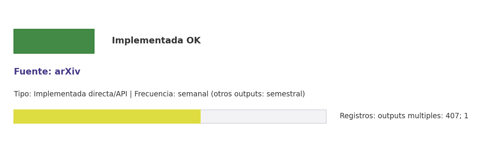

# Brief de fuente implementada: arXiv

**Source key:** `arxiv`  
**Categoria:** Científica  
**Madurez:** Implementada OK  
**Tipo:** Implementada directa/API  
**Decision operativa:** `mantener`

## Ficha rapida para Fernanda

- **Tipo de datos descargados:** CSV de vigilancia semanal y CSV de trabajos arXiv CCHEN cuando hay DOI/autor/alias asociado.
- **Tipologia de datos:** Preprints, metadatos bibliograficos y vigilancia temprana
- **Uso posible en el observatorio:** Vigilar preprints y produccion temprana en física y areas afines CCHEN.
- **Frecuencia de descarga:** semanal (otros outputs: semestral)
- **Estado:** Implementada y usable con control de calidad/frescura.
- **Decision operativa:** `mantener`

## Comentario para Excel

Implementada para extraccion CCHEN-only; Vigilar preprints y produccion temprana en física y areas afines CCHEN; mantener frecuencia semanal (otros outputs: semestral).

## Que datos ofrece la fuente

Preprints STEM

## Que extraemos para CCHEN

Se guardan artefactos locales trazables: Data/Vigilancia/arxiv_monitor.csv, Data/Publications/cchen_arxiv_works.csv, Data/Publications/arxiv_state.json.

## Como se filtra CCHEN-only

Aliases CCHEN, autores/afiliaciones o DOI ya conocidos; revisar falsos positivos.

## Potencial para el observatorio

Vigilar preprints y produccion temprana en física y areas afines CCHEN.

## Debilidades y riesgos

Riesgo principal: falsos positivos si se relaja el filtro CCHEN-only o si se consume sin curaduria.

## Frecuencia recomendada

semanal (otros outputs: semestral)

## Estado operativo

Estado catalogo: implementada_runtime. Ultima corrida: success; seeded_from_outputs; ultima actualizacion: 2026-05-19; 2026-05-11.

## Evidencia disponible

Conteo registrado: outputs multiples: 407; 1. Calidad: 1.0. Outputs: Data/Vigilancia/arxiv_monitor.csv; Data/Publications/cchen_arxiv_works.csv; Data/Publications/arxiv_state.json. Los conteos corresponden a artefactos distintos; no deben sumarse como una sola tabla.

## Decision

Mantener como fuente implementada del observatorio y exigir evidencia de refresco segun frecuencia declarada.

## URLs

- Sitio: https://arxiv.org
- API: https://info.arxiv.org/help/api/index.html
