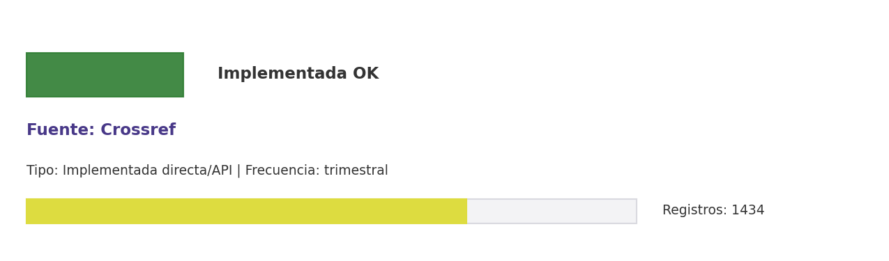

# Brief de fuente implementada: Crossref

**Source key:** `crossref`  
**Categoria:** Científica  
**Madurez:** Implementada OK  
**Tipo:** Implementada directa/API  
**Decision operativa:** `mantener`

## Ficha rapida para Fernanda

- **Tipo de datos descargados:** CSV enriquecido por DOI CCHEN con metadatos, referencias, abstracts y financiadores.
- **Tipologia de datos:** Metadatos DOI, referencias, abstracts y funding
- **Uso posible en el observatorio:** Enriquecer DOI CCHEN con metadatos bibliograficos, referencias, abstracts y funding.
- **Frecuencia de descarga:** trimestral
- **Estado:** Implementada y usable con control de calidad/frescura.
- **Decision operativa:** `mantener`

## Comentario para Excel

Implementada para extraccion CCHEN-only; Enriquecer DOI CCHEN con metadatos bibliograficos, referencias, abstracts y funding; mantener frecuencia trimestral.

## Que datos ofrece la fuente

Metadatos de publicaciones

## Que extraemos para CCHEN

Se guardan artefactos locales trazables: Data/Publications/cchen_crossref_enriched.csv, Data/Publications/crossref_state.json.

## Como se filtra CCHEN-only

DOI CCHEN conocido; no se consulta universo completo.

## Potencial para el observatorio

Enriquecer DOI CCHEN con metadatos bibliograficos, referencias, abstracts y funding.

## Debilidades y riesgos

Riesgo principal: falsos positivos si se relaja el filtro CCHEN-only o si se consume sin curaduria.

## Frecuencia recomendada

trimestral

## Estado operativo

Estado catalogo: implementada_runtime. Ultima corrida: seeded_from_outputs; ultima actualizacion: 2026-05-11.

## Evidencia disponible

Conteo registrado: 1434. Calidad: 1.0. Outputs: Data/Publications/cchen_crossref_enriched.csv; Data/Publications/crossref_state.json.

## Decision

Mantener como fuente implementada del observatorio y exigir evidencia de refresco segun frecuencia declarada.

## URLs

- Sitio: https://www.crossref.org
- API: https://api.crossref.org/swagger-ui/index.html
