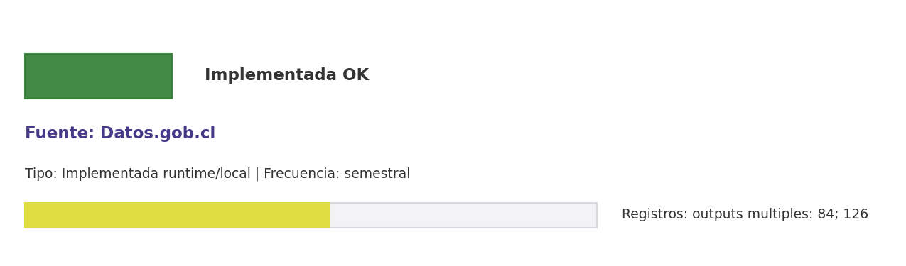

# Brief de fuente implementada: Datos.gob.cl

**Source key:** `datos_gob_cl`  
**Categoria:** Datos Abiertos  
**Madurez:** Implementada OK  
**Tipo:** Implementada runtime/local  
**Decision operativa:** `mantener`

## Ficha rapida para Fernanda

- **Tipo de datos descargados:** CSVs institucionales de convenios y acuerdos públicos asociados a CCHEN.
- **Tipologia de datos:** Convenios, acuerdos e informacion institucional publica
- **Uso posible en el observatorio:** Datos publicos nacionales vinculados a convenios, acuerdos e informacion institucional CCHEN.
- **Frecuencia de descarga:** semestral
- **Estado:** Implementada y usable con control de calidad/frescura.
- **Decision operativa:** `mantener`

## Comentario para Excel

Implementada para extraccion CCHEN-only; Datos publicos nacionales vinculados a convenios, acuerdos e informacion institucional CCHEN; mantener frecuencia semestral.

## Que datos ofrece la fuente

Chile

## Que extraemos para CCHEN

Se guardan artefactos locales trazables: Data/Institutional/clean_Convenios_suscritos_por_la_Com.csv, Data/Institutional/clean_Acuerdos_e_instrumentos_intern.csv.

## Como se filtra CCHEN-only

Sin API; eventual carga manual/curada.

## Potencial para el observatorio

Datos publicos nacionales vinculados a convenios, acuerdos e informacion institucional CCHEN.

## Debilidades y riesgos

Aparece como implementada por runtime, pero su origen en la matriz no era API priorizada; mantener trazabilidad de metodo y outputs.

## Frecuencia recomendada

semestral

## Estado operativo

Estado catalogo: implementada_runtime. Ultima corrida: seeded_from_outputs; ultima actualizacion: 2026-03-21.

## Evidencia disponible

Conteo registrado: outputs multiples: 84; 126. Calidad: 1.0. Outputs: Data/Institutional/clean_Convenios_suscritos_por_la_Com.csv; Data/Institutional/clean_Acuerdos_e_instrumentos_intern.csv. Los conteos corresponden a artefactos distintos; no deben sumarse como una sola tabla.

## Decision

Mantener como fuente implementada del observatorio y exigir evidencia de refresco segun frecuencia declarada.

## URLs

- Sitio: https://datos.gob.cl
