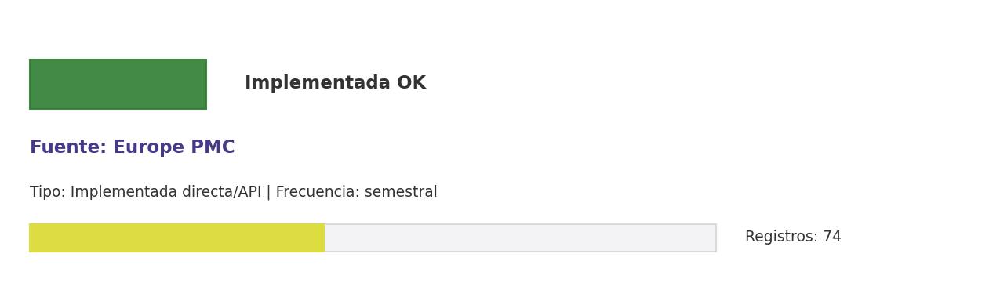

# Brief de fuente implementada: Europe PMC

**Source key:** `europmc_works`  
**Categoria:** Científica  
**Madurez:** Implementada OK  
**Tipo:** Implementada directa/API  
**Decision operativa:** `mantener`

## Ficha rapida para Fernanda

- **Tipo de datos descargados:** CSV de publicaciones biomédicas filtradas por CCHEN, autores, afiliaciones o DOI conocidos.
- **Tipologia de datos:** Publicaciones biomédicas y metadatos Europe PMC
- **Uso posible en el observatorio:** Complementar publicaciones biomédicas y de radiofarmacia con metadatos Europe PMC.
- **Frecuencia de descarga:** semestral
- **Estado:** Implementada y usable con control de calidad/frescura.
- **Decision operativa:** `mantener`

## Comentario para Excel

Implementada para extraccion CCHEN-only; Complementar publicaciones biomédicas y de radiofarmacia con metadatos Europe PMC; mantener frecuencia semestral.

## Que datos ofrece la fuente

Biomedicina

## Que extraemos para CCHEN

Se guardan artefactos locales trazables: Data/Publications/cchen_europmc_works.csv, Data/Publications/europmc_state.json.

## Como se filtra CCHEN-only

Aliases CCHEN, autores/afiliaciones o DOI ya conocidos; revisar falsos positivos.

## Potencial para el observatorio

Complementar publicaciones biomédicas y de radiofarmacia con metadatos Europe PMC.

## Debilidades y riesgos

Riesgo principal: falsos positivos si se relaja el filtro CCHEN-only o si se consume sin curaduria.

## Frecuencia recomendada

semestral

## Estado operativo

Estado catalogo: implementada_runtime. Ultima corrida: seeded_from_outputs; ultima actualizacion: 2026-03-22.

## Evidencia disponible

Conteo registrado: 74. Calidad: 1.0. Outputs: Data/Publications/cchen_europmc_works.csv; Data/Publications/europmc_state.json.

## Decision

Mantener como fuente implementada del observatorio y exigir evidencia de refresco segun frecuencia declarada.

## URLs

- Sitio: https://europepmc.org/
- API: https://europepmc.org/RestfulWebService
