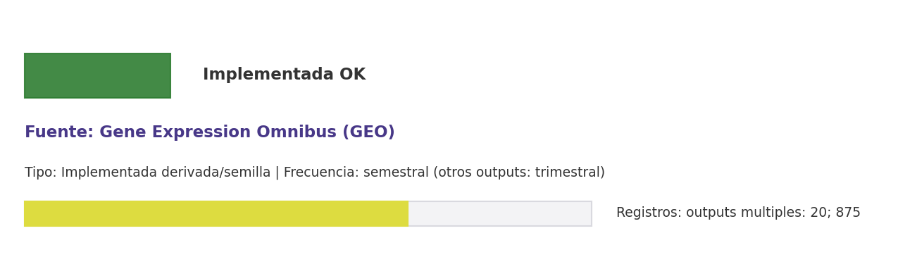

# Brief de fuente implementada: Gene Expression Omnibus (GEO)

**Source key:** `gene_expression_omnibus_geo`  
**Categoria:** Life Sciences  
**Madurez:** Implementada OK  
**Tipo:** Implementada derivada/semilla  
**Decision operativa:** `mantener_con_observacion`

## Ficha rapida para Fernanda

- **Tipo de datos descargados:** No hay extractor directo GEO; la evidencia viene de PubMed/radiofarmacia como aproximacion temática.
- **Tipologia de datos:** Datos de expresion génica relacionados por flujos derivados
- **Uso posible en el observatorio:** Sirve como evidencia temática o vigilancia exploratoria; no como indicador directo de la fuente original.
- **Frecuencia de descarga:** semestral (otros outputs: trimestral)
- **Estado:** Implementada como derivada/semilla; requiere nota metodologica al usarla.
- **Decision operativa:** `mantener_con_observacion`

## Comentario para Excel

Implementada como fuente derivada/semilla CCHEN-only; Aporta datos expresión génica para completar vistas del observatorio; mantener como evidencia tecnica, no como conexion directa a la fuente original.

## Que datos ofrece la fuente

Datos expresión génica

## Que extraemos para CCHEN

La evidencia actual proviene de flujos relacionados ya implementados (PubMed works; Radiofarmacia CCHEN seeded). No hay extractor directo propio para esta fuente.

## Como se filtra CCHEN-only

Aliases CCHEN, autores/afiliaciones o DOI ya conocidos; revisar falsos positivos.

## Potencial para el observatorio

Aporta datos expresión génica para completar vistas del observatorio.

## Debilidades y riesgos

Aparece como implementada por runtime, pero su origen en la matriz no era API priorizada; mantener trazabilidad de metodo y outputs.

## Frecuencia recomendada

semestral (otros outputs: trimestral)

## Estado operativo

Estado catalogo: implementada_runtime. Ultima corrida: seeded_from_outputs; success; ultima actualizacion: 2026-05-11; 2026-05-19.

## Evidencia disponible

Conteo registrado: outputs multiples: 20; 875. Calidad: 1.0. Outputs: Data/Publications/cchen_pubmed_works.csv; Data/Publications/pubmed_state.json; Data/Gobernanza/radiofarmacia_cchen_seeds.csv; Data/Gobernanza/radiofarmacia_cchen_pubchem_compounds.csv; Data/Gobernanza/radiofarmacia_cchen_literature.csv; Data/Gobernanza/radiofarmacia_cchen_status.csv; Data/Gobernanza/radiofarmacia_cchen_state.json; Data/Gobernanza/radiofarmacia_cchen_literature_curated.csv; Data/Gobernanza/radiofarmacia_cchen_compounds_curated.csv; Data/Gobernanza/radiofarmacia_cchen_curation_summary.csv; Data/Gobernanza/radiofarmacia_cchen_literature_reviewed.csv; Data/Gobernanza/radiofarmacia_cchen_review_summary.csv; Docs/reports/metodologia_curaduria_radiofarmacia_cchen.md; Docs/reports/metodologia_revision_radiofarmacia_cchen.md. Los conteos corresponden a artefactos distintos; no deben sumarse como una sola tabla.

## Decision

Mantener como fuente derivada/semilla; no presentarla como conexión directa a la fuente original hasta implementar extractor propio.

## URLs

- Sitio: https://www.ncbi.nlm.nih.gov/geo/
