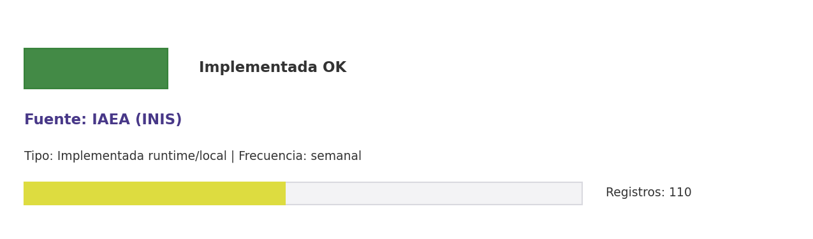

# Brief de fuente implementada: IAEA (INIS)

**Source key:** `iaea_inis_monitor`  
**Categoria:** Nuclear  
**Madurez:** Implementada OK  
**Tipo:** Implementada runtime/local  
**Decision operativa:** `mantener`

## Ficha rapida para Fernanda

- **Tipo de datos descargados:** CSV de vigilancia INIS/IAEA con registros nucleares relevantes a CCHEN.
- **Tipologia de datos:** Registros de informacion nuclear y vigilancia técnica
- **Uso posible en el observatorio:** Vigilancia especializada de INIS/IAEA para informacion nuclear relevante a CCHEN.
- **Frecuencia de descarga:** semanal
- **Estado:** Implementada y usable con control de calidad/frescura.
- **Decision operativa:** `mantener`

## Comentario para Excel

Implementada para extraccion CCHEN-only; Vigilancia especializada de INIS/IAEA para informacion nuclear relevante a CCHEN; mantener frecuencia semanal.

## Que datos ofrece la fuente

Literatura nuclear

## Que extraemos para CCHEN

Se guardan artefactos locales trazables: Data/Vigilancia/iaea_inis_monitor.csv, Data/Vigilancia/iaea_inis_state.json.

## Como se filtra CCHEN-only

Sin API; eventual carga manual/curada.

## Potencial para el observatorio

Vigilancia especializada de INIS/IAEA para informacion nuclear relevante a CCHEN.

## Debilidades y riesgos

Aparece como implementada por runtime, pero su origen en la matriz no era API priorizada; mantener trazabilidad de metodo y outputs.

## Frecuencia recomendada

semanal

## Estado operativo

Estado catalogo: implementada_runtime. Ultima corrida: success; ultima actualizacion: 2026-05-19.

## Evidencia disponible

Conteo registrado: 110. Calidad: 1.0. Outputs: Data/Vigilancia/iaea_inis_monitor.csv; Data/Vigilancia/iaea_inis_state.json.

## Decision

Mantener como fuente implementada del observatorio y exigir evidencia de refresco segun frecuencia declarada.

## URLs

- Sitio: https://inis.iaea.org
