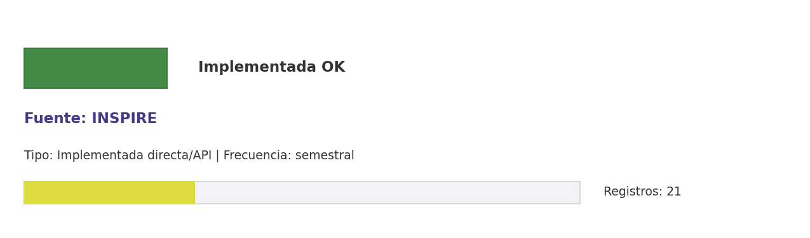

# Brief de fuente implementada: INSPIRE

**Source key:** `inspire_works`  
**Categoria:** Científica  
**Madurez:** Implementada OK  
**Tipo:** Implementada directa/API  
**Decision operativa:** `mantener`

## Ficha rapida para Fernanda

- **Tipo de datos descargados:** CSV de trabajos académicos de fisica filtrados por señal CCHEN.
- **Tipologia de datos:** Publicaciones/preprints de fisica e informacion académica especializada
- **Uso posible en el observatorio:** Cubrir fisica, plasma, altas energias y areas afines donde CCHEN tiene produccion.
- **Frecuencia de descarga:** semestral
- **Estado:** Implementada y usable con control de calidad/frescura.
- **Decision operativa:** `mantener`

## Comentario para Excel

Implementada para extraccion CCHEN-only; Cubrir fisica, plasma, altas energias y areas afines donde CCHEN tiene produccion; mantener frecuencia semestral.

## Que datos ofrece la fuente

Física de alta energía

## Que extraemos para CCHEN

Se guardan artefactos locales trazables: Data/Publications/cchen_inspire_works.csv, Data/Publications/inspire_state.json.

## Como se filtra CCHEN-only

Aliases CCHEN, autores/afiliaciones o DOI ya conocidos; revisar falsos positivos.

## Potencial para el observatorio

Cubrir fisica, plasma, altas energias y areas afines donde CCHEN tiene produccion.

## Debilidades y riesgos

Riesgo principal: falsos positivos si se relaja el filtro CCHEN-only o si se consume sin curaduria.

## Frecuencia recomendada

semestral

## Estado operativo

Estado catalogo: implementada_runtime. Ultima corrida: seeded_from_outputs; ultima actualizacion: 2026-05-11.

## Evidencia disponible

Conteo registrado: 21. Calidad: 1.0. Outputs: Data/Publications/cchen_inspire_works.csv; Data/Publications/inspire_state.json.

## Decision

Mantener como fuente implementada del observatorio y exigir evidencia de refresco segun frecuencia declarada.

## URLs

- Sitio: https://inspirehep.net
- API: https://github.com/inspirehep/rest-api-doc
