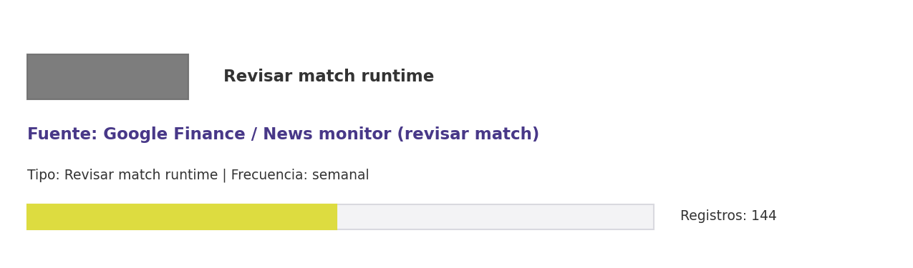

# Brief de fuente implementada: Google Finance / News monitor (revisar match)

**Source key:** `news_monitor`  
**Categoria:** Reportes financieros  
**Madurez:** Revisar match runtime  
**Tipo:** Revisar match runtime  
**Decision operativa:** `revisar_match`

## Ficha rapida para Fernanda

- **Tipo de datos descargados:** CSV de noticias CCHEN/nuclear; no corresponde a descarga financiera desde Google Finance.
- **Tipologia de datos:** Noticias y monitoreo de prensa CCHEN/nuclear; match financiero en revision
- **Uso posible en el observatorio:** Solo serviria para vigilancia de noticias si se reclasifica; no usar como fuente financiera sin confirmacion.
- **Frecuencia de descarga:** semanal
- **Estado:** Requiere confirmacion de correspondencia entre planilla y runtime.
- **Decision operativa:** `revisar_match`

## Comentario para Excel

Revisar match: la planilla indica Google Finance, pero el runtime implementado es News monitor para prensa CCHEN/nuclear; no tratar como fuente financiera sin confirmacion.

## Que datos ofrece la fuente

Overview financiero

## Que extraemos para CCHEN

El artefacto existente es Data/Vigilancia/news_monitor.csv, asociado a monitoreo de prensa CCHEN/nuclear. No corresponde a una extracción financiera de Google Finance.

## Como se filtra CCHEN-only

Filtro del runtime: consulta/curaduria de noticias CCHEN y energia nuclear. El filtro financiero de Google Finance no esta implementado.

## Potencial para el observatorio

Monitoreo de prensa y noticias sobre CCHEN y energia nuclear; no debe confundirse con datos financieros de Google Finance.

## Debilidades y riesgos

La fila del Excel indica Google Finance, pero el runtime conectado corresponde a News monitor. Requiere confirmar si se mantiene como vigilancia de noticias o se excluye del bloque financiero.

## Frecuencia recomendada

semanal

## Estado operativo

Estado catalogo: implementada_runtime. Ultima corrida: success; ultima actualizacion: 2026-05-19.

## Evidencia disponible

Conteo registrado: 144. Calidad: 1.0. Outputs: Data/Vigilancia/news_monitor.csv.

## Decision

Revisar con Fernanda: la planilla apunta a Google Finance, pero el runtime implementado es News monitor para prensa CCHEN/nuclear. Mantener solo si se reclasifica como vigilancia de noticias.

## URLs

- Sitio: https://www.google.com/finance/
