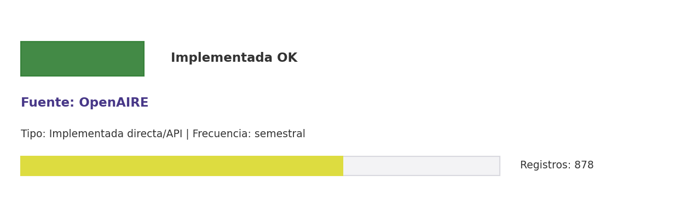

# Brief de fuente implementada: OpenAIRE

**Source key:** `openaire_outputs`  
**Categoria:** Científica  
**Madurez:** Implementada OK  
**Tipo:** Implementada directa/API  
**Decision operativa:** `mantener`

## Ficha rapida para Fernanda

- **Tipo de datos descargados:** CSV de outputs académicos y repositorios asociados a identificadores CCHEN.
- **Tipologia de datos:** Outputs académicos, repositorios y relaciones ORCID/DOI
- **Uso posible en el observatorio:** Consolidar outputs academicos europeos y repositorios vinculados a ORCID/DOI CCHEN.
- **Frecuencia de descarga:** semestral
- **Estado:** Implementada y usable con control de calidad/frescura.
- **Decision operativa:** `mantener`

## Comentario para Excel

Implementada para extraccion CCHEN-only; Consolidar outputs academicos europeos y repositorios vinculados a ORCID/DOI CCHEN; mantener frecuencia semestral.

## Que datos ofrece la fuente

Ciencia abierta UE

## Que extraemos para CCHEN

Se guardan artefactos locales trazables: Data/ResearchOutputs/cchen_openaire_outputs.csv, Data/ResearchOutputs/openaire_state.json.

## Como se filtra CCHEN-only

ORCID/ROR/DOI CCHEN y metadatos de outputs institucionales.

## Potencial para el observatorio

Consolidar outputs academicos europeos y repositorios vinculados a ORCID/DOI CCHEN.

## Debilidades y riesgos

Riesgo principal: falsos positivos si se relaja el filtro CCHEN-only o si se consume sin curaduria.

## Frecuencia recomendada

semestral

## Estado operativo

Estado catalogo: implementada_runtime. Ultima corrida: seeded_from_outputs; ultima actualizacion: 2026-05-11.

## Evidencia disponible

Conteo registrado: 878. Calidad: 1.0. Outputs: Data/ResearchOutputs/cchen_openaire_outputs.csv; Data/ResearchOutputs/openaire_state.json.

## Decision

Mantener como fuente implementada del observatorio y exigir evidencia de refresco segun frecuencia declarada.

## URLs

- Sitio: https://www.openaire.eu/
