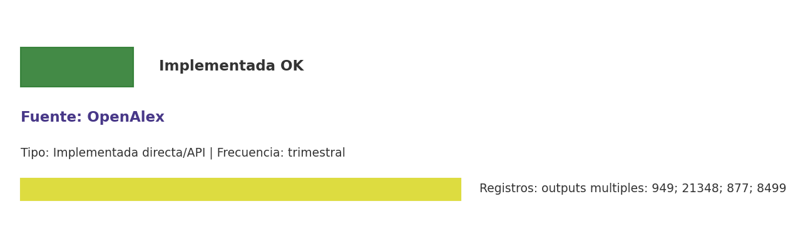

# Brief de fuente implementada: OpenAlex

**Source key:** `openalex`  
**Categoria:** Científica  
**Madurez:** Implementada OK  
**Tipo:** Implementada directa/API  
**Decision operativa:** `mantener`

## Ficha rapida para Fernanda

- **Tipo de datos descargados:** CSVs de works, authorships, conceptos, grants y tablas bibliométricas CCHEN.
- **Tipologia de datos:** Publicaciones, autores, conceptos, afiliaciones y citas
- **Uso posible en el observatorio:** Base principal de publicaciones, autores, conceptos y relaciones bibliométricas CCHEN.
- **Frecuencia de descarga:** trimestral
- **Estado:** Implementada y usable con control de calidad/frescura.
- **Decision operativa:** `mantener`

## Comentario para Excel

Implementada para extraccion CCHEN-only; Base principal de publicaciones, autores, conceptos y relaciones bibliométricas CCHEN; mantener frecuencia trimestral.

## Que datos ofrece la fuente

Grafo académico

## Que extraemos para CCHEN

Se guardan artefactos locales trazables: Data/Publications/cchen_openalex_works.csv, Data/Publications/openalex_state.json, Data/Publications/cchen_openalex_concepts.csv y 2 artefactos adicionales.

## Como se filtra CCHEN-only

Sin API; eventual carga manual/curada.

## Potencial para el observatorio

Base principal de publicaciones, autores, conceptos y relaciones bibliométricas CCHEN.

## Debilidades y riesgos

Aparece como implementada por runtime, pero su origen en la matriz no era API priorizada; mantener trazabilidad de metodo y outputs.

## Frecuencia recomendada

trimestral

## Estado operativo

Estado catalogo: implementada_runtime. Ultima corrida: seeded_from_outputs; ultima actualizacion: 2026-05-11; 2026-03-21; 2026-03-29; 2026-03-22.

## Evidencia disponible

Conteo registrado: outputs multiples: 949; 21348; 877; 8499. Calidad: 1.0. Outputs: Data/Publications/cchen_openalex_works.csv; Data/Publications/openalex_state.json; Data/Publications/cchen_openalex_concepts.csv; Data/Publications/cchen_citation_graph.csv; Data/Publications/cchen_citing_papers.csv. Los conteos corresponden a artefactos distintos; no deben sumarse como una sola tabla.

## Decision

Mantener como fuente implementada del observatorio y exigir evidencia de refresco segun frecuencia declarada.

## URLs

- Sitio: https://openalex.org/
