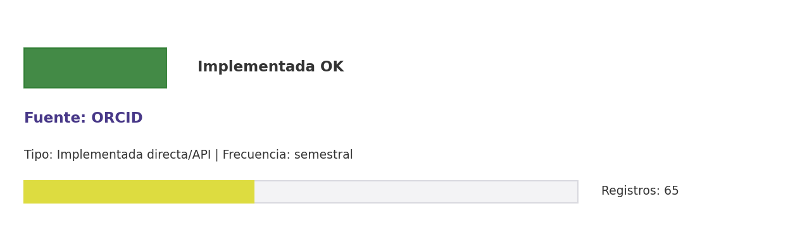

# Brief de fuente implementada: ORCID

**Source key:** `orcid`  
**Categoria:** Científica  
**Madurez:** Implementada OK  
**Tipo:** Implementada directa/API  
**Decision operativa:** `mantener`

## Ficha rapida para Fernanda

- **Tipo de datos descargados:** CSV de perfiles ORCID de investigadores CCHEN y metadatos asociados.
- **Tipologia de datos:** Perfiles de investigadores, afiliaciones e identificadores
- **Uso posible en el observatorio:** Mantener perfiles de investigadores CCHEN, afiliaciones, identificadores y obras declaradas.
- **Frecuencia de descarga:** semestral
- **Estado:** Implementada y usable con control de calidad/frescura.
- **Decision operativa:** `mantener`

## Comentario para Excel

Implementada para extraccion CCHEN-only; Mantener perfiles de investigadores CCHEN, afiliaciones, identificadores y obras declaradas; mantener frecuencia semestral.

## Que datos ofrece la fuente

Identificadores investigadores

## Que extraemos para CCHEN

Se guardan artefactos locales trazables: Data/Researchers/cchen_researchers_orcid.csv, Data/Researchers/orcid_state.json.

## Como se filtra CCHEN-only

Afiliacion/nombre investigador CCHEN y ORCID conocido.

## Potencial para el observatorio

Mantener perfiles de investigadores CCHEN, afiliaciones, identificadores y obras declaradas.

## Debilidades y riesgos

Riesgo principal: falsos positivos si se relaja el filtro CCHEN-only o si se consume sin curaduria.

## Frecuencia recomendada

semestral

## Estado operativo

Estado catalogo: implementada_runtime. Ultima corrida: seeded_from_outputs; ultima actualizacion: 2026-05-11.

## Evidencia disponible

Conteo registrado: 65. Calidad: 1.0. Outputs: Data/Researchers/cchen_researchers_orcid.csv; Data/Researchers/orcid_state.json.

## Decision

Mantener como fuente implementada del observatorio y exigir evidencia de refresco segun frecuencia declarada.

## URLs

- Sitio: https://orcid.org
- API: https://info.orcid.org/documentation/features/public-api/
