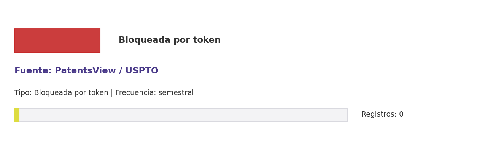

# Brief de fuente implementada: PatentsView / USPTO

**Source key:** `patentsview_uspto`  
**Categoria:** Patentes  
**Madurez:** Bloqueada por token  
**Tipo:** Bloqueada por token  
**Decision operativa:** `bloqueada_por_token`

## Ficha rapida para Fernanda

- **Tipo de datos descargados:** Salida prevista para patentes USPTO CCHEN; actualmente sin registros por falta de API key.
- **Tipologia de datos:** Patentes USPTO, solicitantes e inventores
- **Uso posible en el observatorio:** Serviria para propiedad industrial internacional cuando exista API key; por ahora queda como brecha documentada.
- **Frecuencia de descarga:** semestral
- **Estado:** Registrada, pero bloqueada hasta configurar credencial/API key.
- **Decision operativa:** `bloqueada_por_token`

## Comentario para Excel

Implementada/registrada para CCHEN-only, pero bloqueada hasta configurar PATENTSVIEW_API_KEY; no reemplaza INAPI local.

## Que datos ofrece la fuente

Análisis patentes USPTO

## Que extraemos para CCHEN

Se guardan artefactos locales trazables: Data/Patents/cchen_patents_uspto.csv.

## Como se filtra CCHEN-only

Aliases de solicitante/inventor CCHEN; requiere PATENTSVIEW_API_KEY.

## Potencial para el observatorio

Buscar patentes USPTO asociadas a aliases CCHEN; actualmente depende de API key.

## Debilidades y riesgos

Registrada, pero la corrida queda bloqueada hasta configurar PATENTSVIEW_API_KEY.

## Frecuencia recomendada

semestral

## Estado operativo

Estado catalogo: implementada_runtime. Ultima corrida: failed; ultima actualizacion: sin fecha.

## Evidencia disponible

Conteo registrado: 0. Calidad: 0.0. Outputs: Data/Patents/cchen_patents_uspto.csv.

## Decision

Mantener registrada, pero no exigir corrida hasta configurar PATENTSVIEW_API_KEY; separar de INAPI local.

## URLs

- Sitio: https://patentsview.org; https://uspto.gov
- API: https://patentsview.org/apis/purpose; https://developer.uspto.gov/api-catalog
