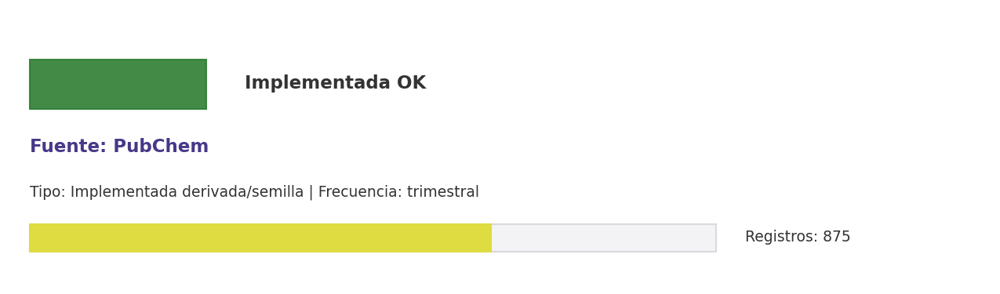

# Brief de fuente implementada: PubChem

**Source key:** `radiofarmacia_cchen_seeded`  
**Categoria:** Bio/Farma  
**Madurez:** Implementada OK  
**Tipo:** Implementada derivada/semilla  
**Decision operativa:** `mantener_con_observacion`

## Ficha rapida para Fernanda

- **Tipo de datos descargados:** CSVs de semillas, compuestos/radionuclidos, literatura, curaduria y revision operativa.
- **Tipologia de datos:** Radiofarmacos, radionuclidos, compuestos PubChem y literatura técnica
- **Uso posible en el observatorio:** Sirve como evidencia temática o vigilancia exploratoria; no como indicador directo de la fuente original.
- **Frecuencia de descarga:** trimestral
- **Estado:** Implementada como derivada/semilla; requiere nota metodologica al usarla.
- **Decision operativa:** `mantener_con_observacion`

## Comentario para Excel

Implementada como fuente derivada/semilla CCHEN-only; Consolidar semillas de radiofarmacos, radionuclidos, PubChem y literatura abierta relevante; mantener como evidencia tecnica, no como conexion directa a la fuente original.

## Que datos ofrece la fuente

Química

## Que extraemos para CCHEN

La evidencia actual proviene de flujos relacionados ya implementados (Radiofarmacia CCHEN seeded). No hay extractor directo propio para esta fuente.

## Como se filtra CCHEN-only

Probe CCHEN-only por alias institucional; activar solo con resultados relevantes.

## Potencial para el observatorio

Consolidar semillas de radiofarmacos, radionuclidos, PubChem y literatura abierta relevante.

## Debilidades y riesgos

Usa semillas tematicas; ampliar semillas exige justificacion experta para evitar ruido.

## Frecuencia recomendada

trimestral

## Estado operativo

Estado catalogo: implementada_runtime. Ultima corrida: success; ultima actualizacion: 2026-05-19.

## Evidencia disponible

Conteo registrado: 875. Calidad: 1.0. Outputs: Data/Gobernanza/radiofarmacia_cchen_seeds.csv; Data/Gobernanza/radiofarmacia_cchen_pubchem_compounds.csv; Data/Gobernanza/radiofarmacia_cchen_literature.csv; Data/Gobernanza/radiofarmacia_cchen_status.csv; Data/Gobernanza/radiofarmacia_cchen_state.json; Data/Gobernanza/radiofarmacia_cchen_literature_curated.csv; Data/Gobernanza/radiofarmacia_cchen_compounds_curated.csv; Data/Gobernanza/radiofarmacia_cchen_curation_summary.csv; Data/Gobernanza/radiofarmacia_cchen_literature_reviewed.csv; Data/Gobernanza/radiofarmacia_cchen_review_summary.csv; Docs/reports/metodologia_curaduria_radiofarmacia_cchen.md; Docs/reports/metodologia_revision_radiofarmacia_cchen.md.

## Decision

Mantener como fuente derivada/semilla; no presentarla como conexión directa a la fuente original hasta implementar extractor propio.

## URLs

- Sitio: https://pubchem.ncbi.nlm.nih.gov
- API: https://pubchem.ncbi.nlm.nih.gov/docs/pug-rest#section=The-URL-Path
