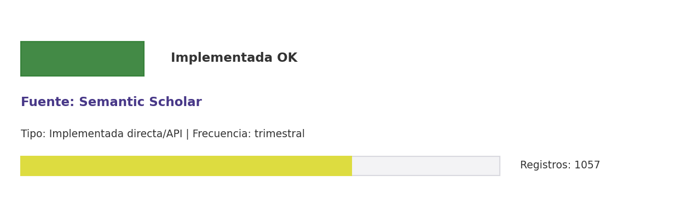

# Brief de fuente implementada: Semantic Scholar

**Source key:** `semantic_scholar`  
**Categoria:** Científica  
**Madurez:** Implementada OK  
**Tipo:** Implementada directa/API  
**Decision operativa:** `mantener`

## Ficha rapida para Fernanda

- **Tipo de datos descargados:** CSV de metadatos/citas Semantic Scholar asociados a publicaciones CCHEN.
- **Tipologia de datos:** Metadatos académicos, autores, citas y relaciones semanticas
- **Uso posible en el observatorio:** Complementar citas, autores y metadatos semanticos de publicaciones CCHEN.
- **Frecuencia de descarga:** trimestral
- **Estado:** Implementada y usable con control de calidad/frescura.
- **Decision operativa:** `mantener`

## Comentario para Excel

Implementada para extraccion CCHEN-only; Complementar citas, autores y metadatos semanticos de publicaciones CCHEN; mantener frecuencia trimestral.

## Que datos ofrece la fuente

Buscador literatura IA

## Que extraemos para CCHEN

Se guardan artefactos locales trazables: Data/Publications/cchen_semantic_scholar.csv.

## Como se filtra CCHEN-only

Aliases CCHEN, autores/afiliaciones o DOI ya conocidos; revisar falsos positivos.

## Potencial para el observatorio

Complementar citas, autores y metadatos semanticos de publicaciones CCHEN.

## Debilidades y riesgos

Riesgo principal: falsos positivos si se relaja el filtro CCHEN-only o si se consume sin curaduria.

## Frecuencia recomendada

trimestral

## Estado operativo

Estado catalogo: implementada_runtime. Ultima corrida: seeded_from_outputs; ultima actualizacion: 2026-05-11.

## Evidencia disponible

Conteo registrado: 1057. Calidad: 1.0. Outputs: Data/Publications/cchen_semantic_scholar.csv.

## Decision

Mantener como fuente implementada del observatorio y exigir evidencia de refresco segun frecuencia declarada.

## URLs

- Sitio: https://semanticscholar.org
- API: https://www.semanticscholar.org/product/api
