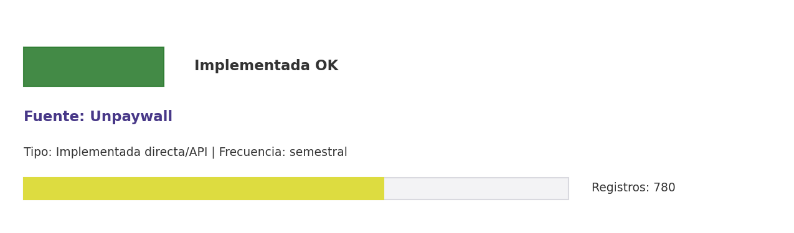

# Brief de fuente implementada: Unpaywall

**Source key:** `unpaywall_oa`  
**Categoria:** Científica  
**Madurez:** Implementada OK  
**Tipo:** Implementada directa/API  
**Decision operativa:** `mantener`

## Ficha rapida para Fernanda

- **Tipo de datos descargados:** CSV con estado open access por DOI CCHEN.
- **Tipologia de datos:** Estado de acceso abierto por DOI
- **Uso posible en el observatorio:** Determinar disponibilidad open access de DOI CCHEN.
- **Frecuencia de descarga:** semestral
- **Estado:** Implementada y usable con control de calidad/frescura.
- **Decision operativa:** `mantener`

## Comentario para Excel

Implementada para extraccion CCHEN-only; Determinar disponibilidad open access de DOI CCHEN; mantener frecuencia semestral.

## Que datos ofrece la fuente

Acceso abierto a papers

## Que extraemos para CCHEN

Se guardan artefactos locales trazables: Data/Publications/cchen_unpaywall_oa.csv.

## Como se filtra CCHEN-only

DOI CCHEN conocido; no se consulta universo completo.

## Potencial para el observatorio

Determinar disponibilidad open access de DOI CCHEN.

## Debilidades y riesgos

Riesgo principal: falsos positivos si se relaja el filtro CCHEN-only o si se consume sin curaduria.

## Frecuencia recomendada

semestral

## Estado operativo

Estado catalogo: implementada_runtime. Ultima corrida: success; ultima actualizacion: 2026-05-19.

## Evidencia disponible

Conteo registrado: 780. Calidad: 1.0. Outputs: Data/Publications/cchen_unpaywall_oa.csv.

## Decision

Mantener como fuente implementada del observatorio y exigir evidencia de refresco segun frecuencia declarada.

## URLs

- Sitio: https://unpaywall.org
- API: https://unpaywall.org/products/api
