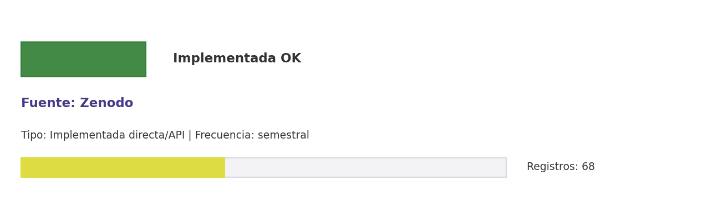

# Brief de fuente implementada: Zenodo

**Source key:** `zenodo_outputs`  
**Categoria:** Científica  
**Madurez:** Implementada OK  
**Tipo:** Implementada directa/API  
**Decision operativa:** `mantener`

## Ficha rapida para Fernanda

- **Tipo de datos descargados:** CSV de metadatos Zenodo y CSV de inventario de archivos; no descarga archivos binarios.
- **Tipologia de datos:** Metadatos de datasets, presentaciones y archivos asociados
- **Uso posible en el observatorio:** Inventariar metadatos de datasets, presentaciones y outputs CCHEN en Zenodo sin descargar archivos.
- **Frecuencia de descarga:** semestral
- **Estado:** Implementada y usable con control de calidad/frescura.
- **Decision operativa:** `mantener`

## Comentario para Excel

Implementada para extraccion CCHEN-only; Inventariar metadatos de datasets, presentaciones y outputs CCHEN en Zenodo sin descargar archivos; mantener frecuencia semestral.

## Que datos ofrece la fuente

Repositorio CERN

## Que extraemos para CCHEN

Se guardan artefactos locales trazables: Data/ResearchOutputs/cchen_zenodo_metadata.csv, Data/ResearchOutputs/cchen_zenodo_files.csv, Data/ResearchOutputs/zenodo_cchen_state.json y 1 artefactos adicionales.

## Como se filtra CCHEN-only

Aliases institucionales CCHEN visibles en afiliacion o metadatos; metadata-only, sin descarga de archivos.

## Potencial para el observatorio

Inventariar metadatos de datasets, presentaciones y outputs CCHEN en Zenodo sin descargar archivos.

## Debilidades y riesgos

Riesgo principal: falsos positivos si se relaja el filtro CCHEN-only o si se consume sin curaduria.

## Frecuencia recomendada

semestral

## Estado operativo

Estado catalogo: implementada_runtime. Ultima corrida: success; ultima actualizacion: 2026-05-19.

## Evidencia disponible

Conteo registrado: 68. Calidad: 1.0. Outputs: Data/ResearchOutputs/cchen_zenodo_metadata.csv; Data/ResearchOutputs/cchen_zenodo_files.csv; Data/ResearchOutputs/zenodo_cchen_state.json; Data/Gobernanza/curaduria_zenodo_cchen.csv.

## Decision

Mantener como fuente implementada del observatorio y exigir evidencia de refresco segun frecuencia declarada.

## URLs

- Sitio: https://zenodo.org
- API: https://developers.zenodo.org/
