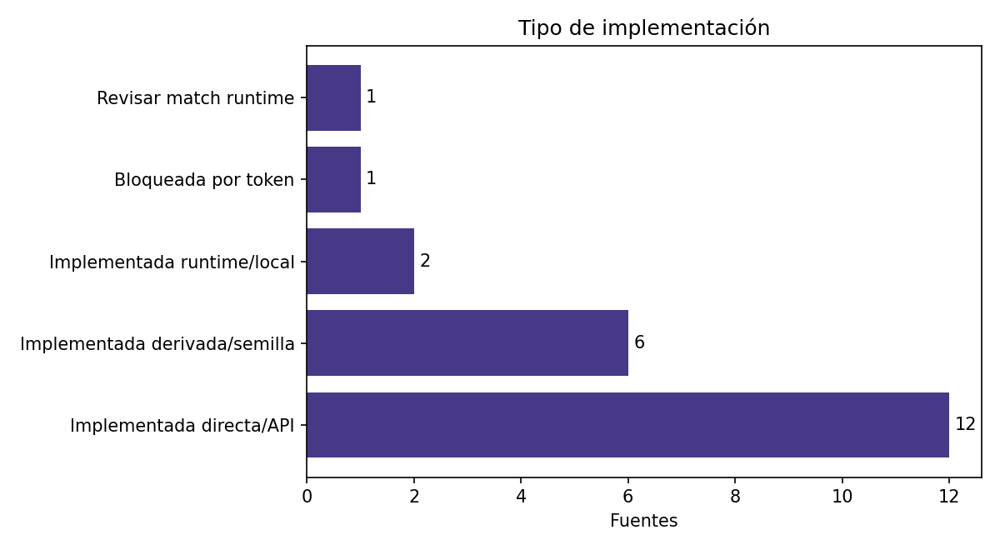
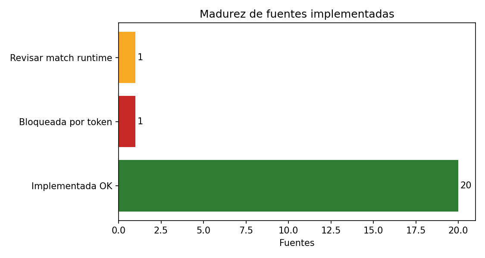

# Resumen ejecutivo - Fuentes implementadas desde matriz Fernanda

Fecha: 2026-05-19

Se documentaron 22 fuentes implementadas provenientes de la matriz de Fernanda. El paquete separa conexiones directas/API, fuentes derivadas por semillas, runtime local y casos que requieren revision antes de presentarse como fuente estable.

## Lectura ejecutiva

- Fuentes directas/API listas: 12.
- Fuentes derivadas o por semillas: 6.
- Fuentes bloqueadas por token: 1.
- Matches a revisar: 1.
- Regla metodologica: no se descarga universo completo; toda fuente debe operar CCHEN-only o por semillas justificadas.

## Decisiones operativas

| Decision | Fuentes |
| --- | ---: |
| `mantener` | 14 |
| `mantener_con_observacion` | 6 |
| `bloqueada_por_token` | 1 |
| `revisar_match` | 1 |

## Tipo de implementacion

| Tipo | Fuentes |
| --- | ---: |
| Implementada directa/API | 12 |
| Implementada derivada/semilla | 6 |
| Implementada runtime/local | 2 |
| Bloqueada por token | 1 |
| Revisar match runtime | 1 |

## Madurez

| Madurez | Fuentes |
| --- | ---: |
| Implementada OK | 20 |
| Bloqueada por token | 1 |
| Revisar match runtime | 1 |

## Alertas para consultora

- `PatentsView / USPTO` esta registrado, pero requiere `PATENTSVIEW_API_KEY`; no debe reemplazar INAPI local.
- `Google Finance / News monitor` debe revisarse: el runtime existente monitorea noticias CCHEN/nuclear, no datos financieros de Google Finance.
- `ClinVar`, `GenBank`, `GEO`, `NIH` y `SRA` aparecen como implementadas por flujos relacionados; presentarlas como derivadas/semilla hasta tener extractores directos.
- Los conteos con multiples valores representan artefactos distintos; no deben sumarse como una unica tabla.

## Fuentes directas/API recomendadas para mostrar primero

arXiv, Crossref, DataCite, Europe PMC, INSPIRE, OpenAIRE, ORCID, PubMed, Semantic Scholar, Unpaywall, Zenodo, OpenAlex.

## Archivos de apoyo

- `comentarios_excel_fernanda_recomendados.md`: comentarios listos para revisar/copiar.
- `indice_fuentes_priorizadas.md`: indice navegable a cada brief.
- `briefs/`: briefs Markdown, LaTeX y PDF por fuente.
- `assets/`: graficos de madurez, tipo de implementacion y tarjetas por fuente.
