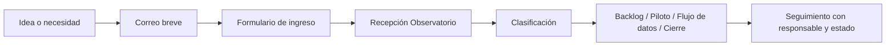

# One-pager — Flujo de ingreso al Observatorio CCHEN

## Objetivo

Establecer un mecanismo simple y trazable para que nuevas necesidades, ideas, oportunidades o solicitudes de mejora lleguen al Observatorio de forma ordenada y priorizable.

## Problema actual

- Las necesidades pueden aparecer en conversaciones, correos o reuniones sin trazabilidad posterior.
- Eso dificulta priorizar, asignar responsables y convertir la solicitud en una mejora concreta del Observatorio.

## Solución propuesta

Crear un flujo estándar de ingreso con cuatro pasos:

1. Detección de una necesidad por una unidad usuaria.
2. Convocatoria breve por correo con enlace a formulario.
3. Recepción y clasificación por el equipo Observatorio.
4. Incorporación a backlog, piloto o flujo de datos, con seguimiento.

## Flujo resumido

## Beneficios esperados

- Ordenar el ingreso de nuevas solicitudes.
- Reducir dependencia de conversaciones informales.
- Priorizar con mayor criterio y transparencia.
- Aumentar trazabilidad para seguimiento y rendición.
- Conectar mejor las necesidades usuarias con el desarrollo del Observatorio.

## Implementación mínima sugerida

- Un correo institucional breve de convocatoria.
- Un formulario único de ingreso.
- Un registro interno simple para recepción y estado.
- Una revisión periódica semanal o quincenal.

## Recomendación

Pilotear este flujo con una unidad prioritaria, por ejemplo DGIn o Vigilancia Tecnológica, antes de ampliarlo a otras áreas.

## Estado

- Documento conceptual para revisión de jefatura.
- No requiere implementación inmediata.
