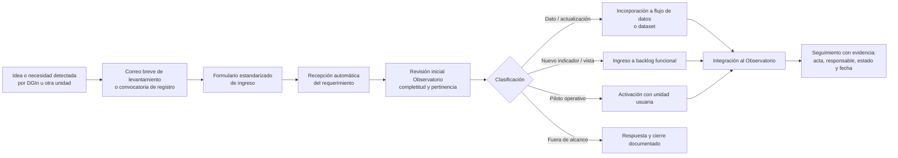

# Propuesta breve — Flujo de ingreso de requerimientos y oportunidades al Observatorio

## Propósito

Proponer un flujo simple y trazable para que nuevas ideas, necesidades, oportunidades o solicitudes de mejora lleguen al Observatorio CCHEN de manera ordenada, con responsable, evidencia y criterio de incorporación.

La meta es evitar que los requerimientos queden dispersos en correos, conversaciones informales o reuniones sin seguimiento, y transformarlos en entradas operativas para el Observatorio.

## Problema que resuelve

- Hoy una necesidad puede nacer como una idea verbal o un correo aislado.
- Si no existe un canal estructurado, se pierde trazabilidad.
- Esto dificulta priorizar, asignar responsables y convertir la necesidad en un dato, flujo o módulo observable dentro del Observatorio.

## Solución propuesta

Establecer un flujo mínimo de ingreso con 4 piezas:

1. Idea o necesidad detectada por una unidad usuaria.
2. Correo o convocatoria breve que derive a un formulario estándar.
3. Recepción y clasificación por el equipo Observatorio.
4. Evaluación e incorporación al backlog, piloto o módulo operativo del Observatorio.

## Diagrama de flujo

## Componentes mínimos del flujo

### 1. Correo de entrada

Mensaje breve dirigido a jefaturas o contrapartes para explicar:

- cuál es el objetivo,
- por qué conviene registrar la necesidad,
- y dónde dejarla formalmente.

### 2. Formulario estándar

Campos mínimos sugeridos:

- unidad solicitante,
- responsable,
- problema o necesidad,
- uso esperado,
- urgencia,
- evidencia o insumo disponible,
- resultado esperado,
- fecha requerida.

### 3. Revisión del Observatorio

El equipo Observatorio revisa si la solicitud corresponde a:

- carga o mejora de datos,
- nuevo indicador,
- nueva visualización,
- automatización,
- piloto operativo,
- o requerimiento fuera de alcance.

### 4. Incorporación trazable

Toda solicitud aceptada debe quedar con:

- responsable,
- estado,
- prioridad,
- fecha de revisión,
- y evidencia de cierre o avance.

## Beneficio esperado para jefatura

- Mayor orden en el ingreso de nuevas necesidades.
- Mejor priorización entre solicitudes.
- Menor dependencia de conversaciones informales.
- Más trazabilidad para seguimiento y rendición.
- Mejor conexión entre necesidades usuarias y desarrollo del Observatorio.

## Implementación mínima sugerida

Fase 1, muy simple:

- correo institucional de convocatoria,
- formulario único,
- planilla o tabla de recepción,
- revisión semanal o quincenal.

Fase 2:

- integración del formulario con un registro interno del Observatorio,
- estados de avance visibles,
- métricas de ingreso, atención y cierre.

## Recomendación

Pilotear este flujo con una unidad usuaria prioritaria, por ejemplo DGIn o Vigilancia Tecnológica, antes de extenderlo al resto del Observatorio.

## Estado del documento

- Documento conceptual.
- No implica implementación inmediata.
- Útil para presentación breve a jefatura y validación de enfoque.